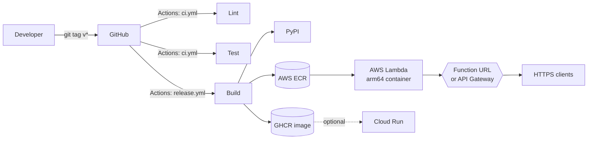

# meapy — Deployment Guide

End-to-end instructions for releasing meapy to PyPI, GHCR, AWS Lambda, and
(optionally) Google Cloud Run.

## Prerequisites

| Tool       | Version  | Notes                                          |
|------------|----------|------------------------------------------------|
| Python     | ≥ 3.10   | Local dev & build                              |
| Docker     | ≥ 24     | With Buildx for multi-arch                     |
| Terraform  | ≥ 1.5    | AWS provider ~> 5.0                            |
| AWS CLI    | ≥ 2.13   | `aws configure` with deploy creds              |
| gcloud     | ≥ 470    | Only for Cloud Run                             |
| gh         | ≥ 2.40   | Optional, for releases from CLI                |

## First-time setup

1. **PyPI trusted publishing** — register `meapy` on PyPI and TestPyPI, add
   GitHub as a trusted publisher pointing at the `release.yml` workflow and
   environments `pypi` / `testpypi`. No tokens are stored as secrets.
2. **GHCR** — nothing to configure; `GITHUB_TOKEN` has `packages: write`.
3. **AWS** — create an S3 bucket + DynamoDB lock table, then fill in
   `infra/backend.tf`. Run `cd infra && terraform init`.
4. **Codecov** — link the repo on codecov.io (the upload step is non-fatal
   if it isn't).

## Local development

```bash
make install        # editable install with dev extras
make lint test      # ruff + mypy + pytest
make docker-test    # run the suite inside the prod-style container
docker compose run --rm meapy-dev   # interactive shell
```

## Cutting a release

```bash
git checkout main && git pull
# Bump version in src/meapy/__init__.py and pyproject.toml
git commit -am "chore(release): v0.2.0"
git tag v0.2.0
git push origin main --tags
```

The `Release` workflow then:

1. Builds sdist + wheel
2. Publishes to TestPyPI (gate)
3. Publishes to PyPI (OIDC)
4. Builds & pushes a multi-arch Docker image to GHCR
5. Creates a GitHub Release with auto-generated notes and attached artefacts

## Deploying to AWS Lambda

```bash
cd infra
terraform init
./deploy.sh --dry-run    # plan only
./deploy.sh              # build, push image to ECR, apply
```

Outputs include `api_endpoint` (Function URL or API Gateway URL) and
`cloudwatch_log_group`.

Toggle the front door with `-var expose_via=apigw` for HTTP API instead of a
Function URL.

## Deploying to Google Cloud Run (optional)

```bash
gcloud auth configure-docker europe-west1-docker.pkg.dev
cd infra/cloudrun
terraform init
terraform apply -var project_id=YOUR_PROJECT
# Then build & push the image to the AR repo printed in outputs.
```

## Rollback

- **PyPI:** PyPI does not allow re-uploading a version. Yank the bad release
  (`pip index yank meapy==X.Y.Z`) and publish a new patch.
- **Docker:** retag the previous good image — `docker buildx imagetools
  create -t ghcr.io/defnalk/meapy:latest ghcr.io/defnalk/meapy:vX.Y.Z`.
- **Lambda:** `terraform apply -var docker_image_tag=vX.Y.Z` against the last
  known good tag, or `aws lambda update-function-code --image-uri ...`.
- **Cloud Run:** `gcloud run services update-traffic meapy
  --to-revisions=<old-revision>=100`.

## Architecture



## Secrets

All credentials live in:

- **GitHub Actions OIDC** for PyPI publishing (no long-lived tokens)
- **GHCR** via `GITHUB_TOKEN`
- **AWS SSM Parameter Store** for any runtime secrets (consume from Lambda
  via `boto3.client("ssm").get_parameter` — none are required today)

Never commit `.env`, `*.tfvars`, or AWS credentials.
